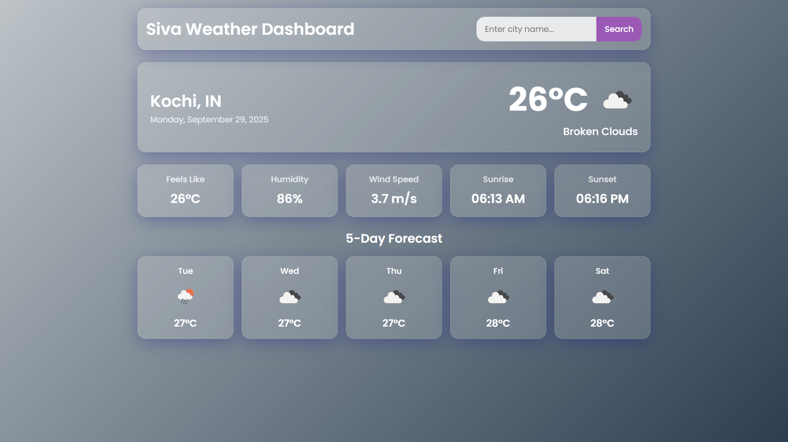

# Dynamic Weather Dashboard

A sleek and responsive web-based weather dashboard that provides real-time weather information for any city in the world. It also features a dynamic background that changes according to the current weather conditions.

*(Suggestion: Replace `screenshot.png` with an actual screenshot of your application)*

---

## ✨ Features

- **Current Weather Data:** Get up-to-the-minute information including temperature, weather condition, "feels like" temperature, humidity, and wind speed.
- **Sunrise & Sunset:** Displays the local sunrise and sunset times.
- **5-Day Forecast:** View a summarized weather forecast for the next five days.
- **City Search:** Easily search for any city worldwide.
- **Geolocation:** Automatically detects the user's location on startup to display local weather (if permission is granted).
- **Persistent State:** Remembers the last searched city and loads it on the next visit.
- **Dynamic Background:** The user interface background changes to match the current weather (e.g., sunny, cloudy, rainy, snowy).
- **Responsive Design:** A clean and modern UI that works on both desktop and mobile devices.

---

## 🛠️ Technologies Used

- **HTML5:** For the basic structure of the web page.
- **CSS3:** For styling the user interface (Note: `style.css` is required).
- **JavaScript (ES6+):** For application logic, API interaction, and DOM manipulation.
- **OpenWeatherMap API:** Used to fetch current and forecast weather data.
- **Google Fonts:** For the 'Poppins' font family.

---

## 🚀 Setup and Installation

To run this project locally, follow these steps:

1. **Clone the repository:**
    bash
    git clone <https://github.com/your-username/weather-dashboard.git>
    cd weather-dashboard

2. **Get an API Key:**
    - Go to OpenWeatherMap and create a free account.
    - Navigate to the 'API keys' tab and get your unique API key.

3. **Add the API Key to the project:**
    - Open the `script.js` file.
    - Find the following line:
    javascript
      const apiKey = 'your api'; // Api key for OpenWeatherMap

    - Replace `'API'` with your own API key.

4. **Run the application:**
    - Simply open the `index.html` file in your web browser.

---

## ⚙️ How It Works

The application is initialized when the DOM is fully loaded.

1. **Initialization (`init`):** The script first checks `localStorage` for a `lastSearchedCity`. If found, it fetches the weather for that city. Otherwise, it attempts to use the browser's Geolocation API to get the user's current position and fetch the weather for that location.

2. **Data Fetching (`getWeatherData`):** When a city is searched or determined via geolocation, the app makes two concurrent API calls to OpenWeatherMap using `Promise.all`:
    - One for the current weather.
    - One for the 5-day forecast.

3. **UI Update (`updateUI`):** Upon receiving the data, the UI is dynamically updated. This includes:
    - Populating the current weather details (temperature, condition, etc.).
    - Generating and displaying cards for the 5-day forecast.
    - Changing the body's background class based on the main weather condition (e.g., 'Clear', 'Clouds', 'Rain').

4. **Event Handling:** An event listener on the search form captures user input, prevents the default form submission, and triggers the `getWeatherData` function.

---

## 🙏 Acknowledgements

- Data provided by OpenWeatherMap.
- Fonts provided by Google Fonts.

