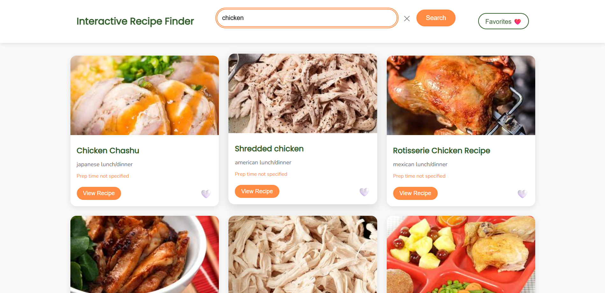

# Interactive Recipe Finder

A dynamic and user-friendly web application for discovering, viewing, and saving your favorite recipes. Built with vanilla JavaScript, this app leverages the Edamam API to provide a vast collection of recipes right at your fingertips.

 
*(Suggestion: Add a screenshot of your application and name it `screenshot.png`)*

## ✨ Features

- **Recipe Search**: Instantly search for recipes by name.
- **Detailed Recipe View**: Click on any recipe to see a detailed modal view with:
  - Ingredients list
  - Key nutrition facts
  - Serving size and calorie count
  - A direct link to the original recipe source.
- **Favorites System**: Save your favorite recipes with a single click. Favorites are stored locally in your browser and persist across sessions.
- **Favorites Gallery**: A dedicated view to browse all your saved recipes.
- **Responsive Design**: A clean, mobile-first design that looks great on any device.
- **Accessible**: Built with accessibility in mind, featuring ARIA labels, semantic HTML, and keyboard navigation support.
- **Loading State**: A clear loading indicator provides feedback during API requests.

## 🚀 Live Demo

[Link to your live demo here]

## 🛠️ Technologies Used

- **Frontend**: HTML5, CSS3, Vanilla JavaScript (ES6+)
- **API**: Edamam Recipe Search API
- **Fonts**: Google Fonts (Poppins & Nunito)

## ⚙️ Setup and Installation

To run this project locally, follow these steps:

1.  **Clone the repository:**
    ```bash
    git clone https://github.com/sivaoffl04/edunet_my_project.git
    cd Interactive-Recipe-Finder
    ```

2.  **Get API Credentials:**
    - Go to the Edamam Recipe API website and sign up for a free account.
    - From your developer dashboard, create a new application to get your **Application ID** and **Application Key**.

3.  **Configure the Application:**
    - Open the `app.js` file.
    - Find the following lines at the top of the file:
      ```javascript
      const EDAMAM_APP_ID = 'sampleid'; // Replace with your actual App ID
      const EDAMAM_APP_KEY = 'yourapi12e8eac27587d40f3650239'; // Replace with your actual App Key
      ```
    - Replace the placeholder values with your actual Edamam `APP_ID` and `APP_KEY`.

4.  **Run the application:**
    - Simply open the `index.html` file in your favorite web browser. No web server or build process is required.

## 📖 How to Use

1.  **Search for a Recipe**: Type a dish name (e.g., "pizza", "chicken curry") into the search bar and click the "Search" button or press Enter.
2.  **View Details**: Browse the search results. Click on a recipe card or the "View Recipe" button to open a modal with detailed information.
3.  **Save a Favorite**: Click the heart icon (`🤍`) on any recipe card to add it to your favorites. The icon will change (`❤️`) to indicate it has been saved.
4.  **View Favorites**: Click the "Favorites ❤️" button in the header to see all your saved recipes.
5.  **Remove a Favorite**: While in the favorites view or the main search view, click the filled heart icon (`❤️`) on a recipe to remove it from your favorites.

## 📄 License

This project is open source and available under the MIT License.

---

*This project was created as a demonstration of frontend development skills using vanilla JavaScript and interacting with a third-party API.*